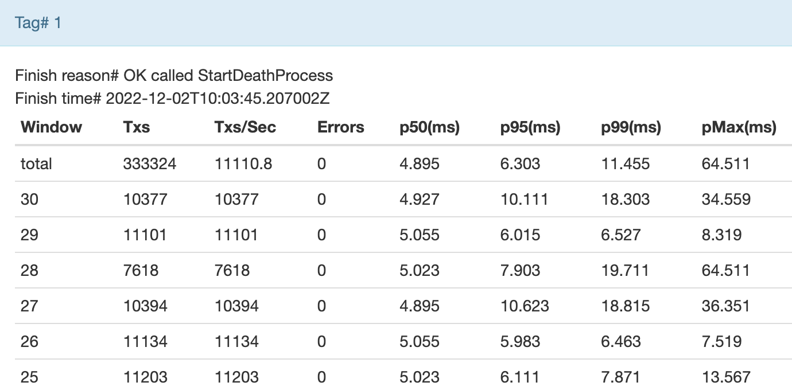

# Обзор тестирования с помощью нагружающих акторов

Тестирование с помощью нагружающих акторов поможет вам понять, какое влияние на производительность системы оказало ваше изменение.

Нагружающие акторы создаются на узлах кластера {{ ydb-short-name }}. Вы можете создать любое количество акторов на любом из узлов. Комбинация акторов разных [типов](#load-actor-type) позволяет запускать множество видов нагрузки.

## Типы акторов {#load-actor-type}

С помощью различных типов акторов вы можете протестировать производительность как системы в целом, так и отдельных компонентов.

Тип | Описание
--- | ---
[KqpLoadStart](load-actors-kqp.md) | Нагружающий актор для подачи нагрузки на KQP часть и, соответственно, на весь кластер в целом. Аналогичен подкоманде [workload {{ ydb-short-name }} CLI](../reference/ydb-cli/commands/workload/index.md), есть два подвида — stock и key-value.
[KeyValueLoadStart](load-actors-key-value.md) | Нагружающий актор для подачи нагрузки на KvTablet.
[LoadStart](load-actors-load-start.md) | Нагружающий актор, подающий нагрузку от лица таблетки. Имитирует таблетку, создает себе TabletId и пишет в указанные storage-группы.
[VDiskLoadStart](load-actors-vdisk.md) | Нагружающий актор для подачи нагрузки на VDisk. Имитирует DSProxy и пишет в локальный VDisk.
[PDiskLoadStart](load-actors-pdisk.md) | Нагружающий актор для подачи write-only нагрузки на PDisk. Имитирует VDisk.
[PDiskReadLoadStart](load-actors-pdisk-read.md) | Нагружающий актор для подачи read-only нагрузки на PDisk. Имитирует VDisk.
[PDiskLogLoadStart](load-actors-pdisk-log.md) | Специальный нагружающий актор, написанный для тестирования вырезания из середины лога PDisk. Имитирует VDisk. Не является нагружающим, в первую очередь направлен на тестирование корректности.
[MemoryLoadStart](load-actors-memory.md) | Специальный нагружающий актор, проверяет производительность работы памяти. Кажется, используется в math bench - иногда запускается на кластере и рисует график времени работы.
[LoadStop](load-actors-load-stop.md) | С помощью этого актора можно остановить нагрузку либо с конкретным тегом, либо со всеми.

## Запуск нагрузки {load-actor-start}

Вы можете запустить нагрузку следующими способами:

* Embedded UI кластера — позволяет создать по спецификации и запустить нагружающий актор либо на текущем узле, либо сразу на всех узлах тенанта.
* Утилита `ydbd` — позволяет на любой узел кластера отправить спецификацию актора с указанием, на каких узлах необходимо создать и запустить актор.

В качестве примера рассмотрим создание и запуск актора KqpLoadStart. Актор обращается к БД `/slice/db` как к key-value хранилищу в 64 потока, длительность нагрузки — 30 секунд. Перед началом работы актор создает необходимые таблицы, после окончания удаляет их. Тег будет присвоен нагрузке автоматически.



- Embedded UI

  1. Откройте страницу управления нагружающими акторами на узле (например, `http://<address>:8765/actors/load`, где `address` — адрес узла кластера, на котором нужно запустить нагрузку).
  1. В поле ввода/вывода вставьте спецификацию актора:

      ```proto
      KqpLoadStart: {
          DurationSeconds: 30
          WindowDuration: 1
          WorkingDir: "/slice/db"
          NumOfSessions: 64
          UniformPartitionsCount: 1000
          DeleteTableOnFinish: 1
          WorkloadType: 0
          Kv: {
              InitRowCount: 1000
              PartitionsByLoad: true
              MaxFirstKey: 18446744073709551615
              StringLen: 8
              ColumnsCnt: 2
              RowsCnt: 1
          }
      }
      ```

  1. Чтобы создать и запустить актор на всех нодах кластера, выберите опцию **Run on all nodes**. Иначе актор будет запущен только на текущей ноде.
  1. Нажмите кнопку **Start new load**. В поле ввода/вывода появится следующее сообщение:

      ```text
      {"status":"OK","tag":1}
      ```

      * `status` — статус запуска нагрузки;
      * `tag` — тег, который был присвоен нагрузке.

- CLI

  1. Создайте файл со спецификацией актора:

      ```proto
      NodeId: 1
      Event: {
          KqpLoadStart: {
              DurationSeconds: 30
              WindowDuration: 1
              WorkingDir: "/slice/db"
              NumOfSessions: 64
              UniformPartitionsCount: 1000
              DeleteTableOnFinish: 1
              WorkloadType: 0
              Kv: {
                  InitRowCount: 1000
                  PartitionsByLoad: true
                  MaxFirstKey: 18446744073709551615
                  StringLen: 8
                  ColumnsCnt: 2
                  RowsCnt: 1
              }
          }
      }
      ```

      * `NodeId` — идентификатор ноды, на которой нужно запустить актор. Чтобы указать несколько нод, перечислите их в отдельных строках:

        ```proto
        NodeId: 1
        NodeId: 2
        ...
        NodeId: N
        Event: {
        ...
        ```

      * `Event` — спецификация актора.

  1. Запустите актор:

      ```bash
      ydbd bs-load-test --server <endpoint> --protobuf "$(cat proto_file)"
      ```

      * `endpoint` — grpc-эндпоит ноды (наприме, `grpc://<address>:31021`, где `address` — адрес узла кластера).
      * `proto_file` — путь к файлу со спецификацией актора.

      Мы не узнаем тег.



## Просмотр результата тестирования {#view-results}

Результаты тестирования можно просмотреть с помощью Embedded UI. Описание выводимых параметров смотрите в документации соответствующего актора.



- Embedded UI

  1. Откройте страницу управления нагружающими акторами на узле (например, `http://<address>:8765/actors/load`, где `address` — адрес узла кластера, на котором была запущена нагрузка).
  1. Нажмите кнопку **Results**.

      Будут отображены результаты завершенных тестирований. Найдите результат с соответствующим тегом.

      


