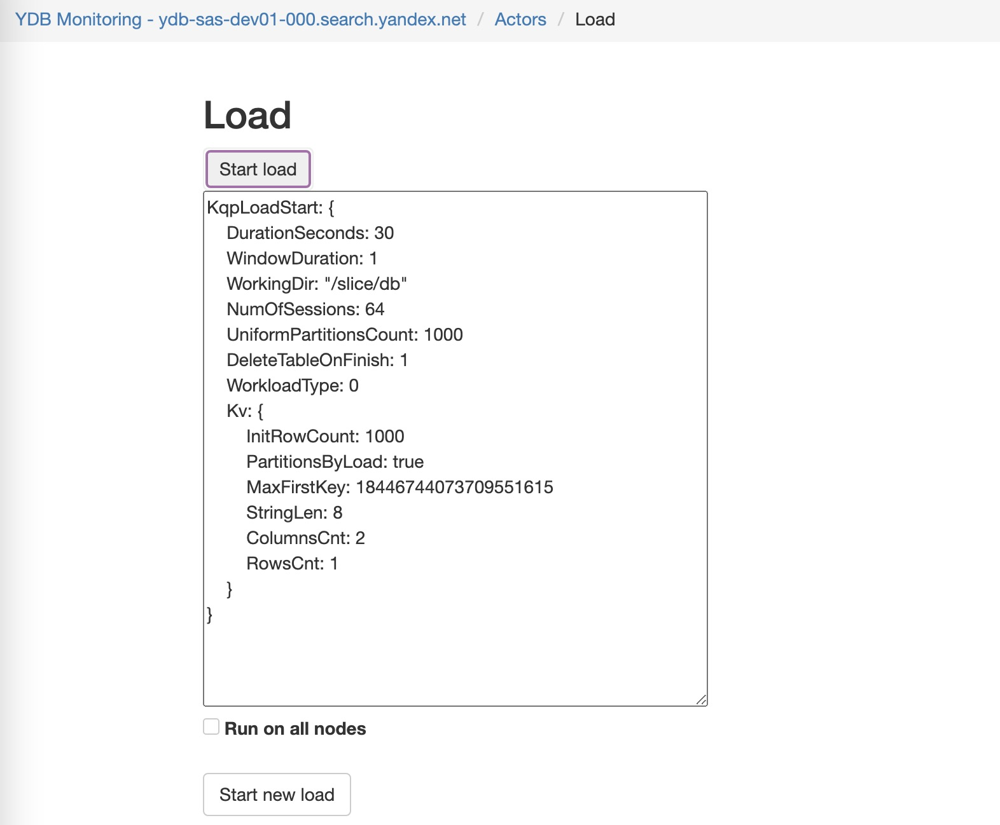

# Тестирование с помощью нагружающих акторов

С помощью нагружающих акторов вы можете запустить нагрузку изнутри системы.

На каждой ноде кластера {{ ydb-short-name }} есть актор-сервис `TLoadActor`, который получает proto с описанием нагрузки, присваивает ему Tag (если не указан явно), и создает соответствующий нагружающий актор.

Вы можете создать любое количество нагружающих акторов на любой из нод. Комбинация акторов разных [типов](#load-actor-type) позволяет запускать множество видов нагрузки. Можно комбинировать место подачи нагрузки (с одной ноды на все, со всех нод на все, со всех нод на одну), а также разные типы нагрузки (на одной ноде актор с большими редкими чтениями, на другой с частыми мелкими записями).

## Типы нагрузки {#load-actor-type}

Тип | Описание
--- | ---
`LoadStart` | нагружающий актор, подающий нагрузку от лица таблетки. Имитирует таблетку, создает себе TabletId и пишет в указанные storage-группы.
`PDiskLoadStart` | нагружающий актор для подачи write-only нагрузки на PDisk. Имитирует VDisk.
`VDiskLoadStart` | нагружающий актор для подачи нагрузки на VDisk. Имитирует DSProxy и пишет в локальный VDisk.
`PDiskReadLoadStart` | нагружающий актор для подачи read-only нагрузки на PDisk. Имитирует VDisk.
`PDiskLogLoadStart` | специальный нагружающий актор, написанный для тестирования вырезания из середины лога PDisk. Имитирует VDisk. Не является нагружающим, в первую очередь направлен на тестирование корректности.
`KeyValueLoadStart` | нагружающий актор для подачи нагрузки на KvTablet.
`KqpLoadStart` | нагружающий актор для подачи нагрузки на KQP часть и, соответственно, на весь кластер в целом. Аналогичен `ydb_cli workload`, есть два подвида - stock и kv.
`MemoryLoadStart` | специальный нагружающий актор, проверяет производительность работы памяти. Кажется, используется в math bench - иногда запускается на кластере и рисует график времени работы.
`LoadStop` | остановить нагрузку либо с конкретным тегом, либо со всеми.

## Запуск нагрузки {load-actor-start}

Вы можете запустить нагрузку следующими способами:

* kikimr-bin
* bash-scripts - по своей сути удобная обёртка над явным вызовом `kikimr bs-load-test`

В обоих случаях подачи нагрузки через [kikimr]{#kikimr-bin-load} необходимо создать proto-файл с текстовым описанием нагрузки. Пример файла:

```proto
NodeId: 1
Event:
    KqpLoadStart: {
        DurationSeconds: 30
        WindowDuration: 1
        WorkingDir: "/slice/db"
        NumOfSessions: 64
        UniformPartitionsCount: 1000
        DeleteTableOnFinish: 1
        WorkloadType: 0
        Kv: {
            InitRowCount: 1000
            PartitionsByLoad: true
            MaxFirstKey: 18446744073709551615
            StringLen: 8
            ColumnsCnt: 2
            RowsCnt: 1
        }
    }
}
```

### kikimr/tools/storage_perf

### kikimr/tools/kqp_load

### kikimr bin {kikimr-bin-load}

```bash
kikimr bs-load-test -s $SERVER --protobuf "$PROTO"
```

### ui

<span style="color:grey">в процессе реализации, готово не до конца</span>


Уже сейчас - можно на ноде по прото-описанию создать нагружающего актора либо на одной текущей ноде, либо сразу на всех нодах тенанта (если страница принадлежит тенанту). В перспективе появятся кнопки, подставляющие разные дефолтные прото-конфиги нагрузки.

## Примеры {#load-examples}

### Запуск нагрузки {#load-examples-start}

```proto
NodeId: 1
Event: { KqpLoadStart: {
    DurationSeconds: 30
    WindowDuration: 1
    WorkingDir: "/slice/db"
    NumOfSessions: 64
    UniformPartitionsCount: 1000
    DeleteTableOnFinish: 1
    WorkloadType: 0
    Kv: {
        InitRowCount: 1000
        PartitionsByLoad: true
        MaxFirstKey: 18446744073709551615
        StringLen: 8
        ColumnsCnt: 2
        RowsCnt: 1
    }
}}
```

```proto
NodeId: ${NODEID}
Event: { LoadStart: {
    DurationSeconds: ${DURATION}
    ScheduleThresholdUs: 0
    ScheduleRoundingUs: 0
    Tablets: {
        Tablets: { TabletId: ${TABLETID} Channel: 0 GroupId: ${GROUPID} Generation: 1 }
        Sizes: { Weight: 1.0 Min: ${SIZE} Max: ${SIZE} }
        WriteIntervals: { Weight: 1.0 Uniform: { MinUs: 50000 MaxUs: 50000 } }
        MaxInFlightRequests: 1

        ReadSizes: { Weight: 1.0 Min: ${SIZE} Max: ${SIZE} }
        ReadIntervals: { Weight: 1.0 Uniform: { MinUs: ${INTERVAL} MaxUs: ${INTERVAL} } }
        MaxInFlightReadRequests: ${IN_FLIGHT}
        FlushIntervals: { Weight: 1.0 Uniform: { MinUs: 10000000 MaxUs: 10000000 } }
        PutHandleClass: ${PUT_HANDLE_CLASS}
        GetHandleClass: ${GET_HANDLE_CLASS}
        Soft: true
    }
}}
```

```proto
NodeId: ${NODEID}
Event: { LoadStart: {
    DurationSeconds: ${DURATION}
    ScheduleThresholdUs: 0
    ScheduleRoundingUs: 0
    Tablets: {
        Tablets: { TabletId: ${TABLETID} Channel: 0 GroupId: ${GROUPID} Generation: 1 }
        Sizes: { Weight: 1.0 Min: ${SIZE} Max: ${SIZE} }
        WriteIntervals: { Weight: 1.0 Uniform: { MinUs: ${INTERVAL} MaxUs: ${INTERVAL} } }
        MaxInFlightRequests: ${IN_FLIGHT}
        FlushIntervals: { Weight: 1.0 Uniform: { MinUs: 10000000 MaxUs: 10000000 } }
        PutHandleClass: ${PUT_HANDLE_CLASS}
        Soft: true
    }
}}
```

```proto
NodeId: ${NODEID}
Event: { MemoryLoadStart: {
    DurationSeconds: ${DURATION}
    IntervalUs: ${INTERVAL}
    BlockSize: ${SIZE}
}}
```

### Остановка нагрузки {load-examples-stop}

```proto
NodeId: 1
Event:
    LoadStop: {
        RemoveAllTags: true
    }
}
```
или
```proto
NodeId: 1
Event:
    LoadStop: {
        Tag: 123
    }
}
```
