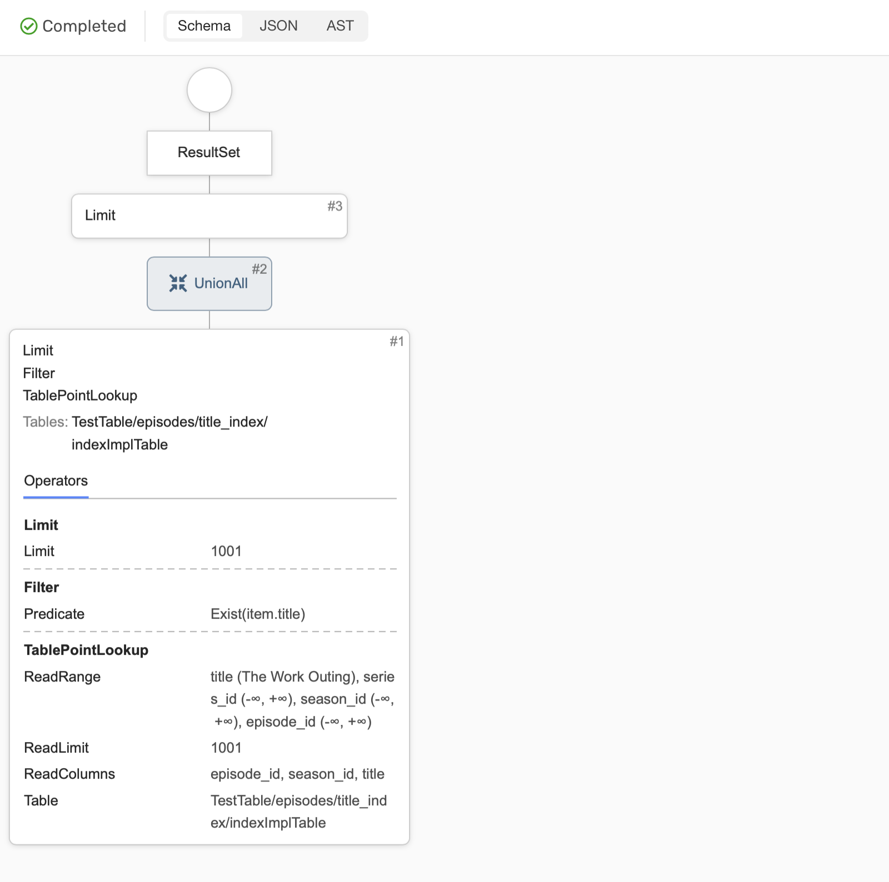

# Построение планов запросов

Чтобы лучше понимать работу запросов, вы можете получить и проанализировать план запроса. 
Структура плана запроса в {{ ydb-short-name }} представляет собой граф. Каждый узел содержит информацию об операциях и таблицах.

Тип операции | Аттрибуты | Комментарий
--- | --- | ---
`TableFullScan` | `ReadColumns` - читаемые колонки | полное сканирование таблицы 
`TableRangeScan` | `ReadColumns` - читаемые колонки<br>`ReadRange` - диапазон ключей, по которому выполняется чтение | чтение определенного диапазона записей
`TablePointLookup` | `ReadColumns` - читаемые колонки<br>`ReadRange` - диапазон или точка, по которым выполняется чтение | чтение по ключу или префиксу ключа
`Upsert` | `Columns` - колонки, которые содержит добавляемая строка | добавление строк в таблицу
`Delete` | | удаление строк из таблицы
`Join` | в описании операции указана используемая стратегия join'а: <br>`Inner`<br>`Left`<br>`LeftOnly`<br>`Right`<br>`RightOnly`<br>`LeftSemi`<br>`RightSemi`<br>`Full`<br>`Cross` | объединение двух таблиц на основе выбранной стратегии
`Filter` | `Predicate` - условие фильтрации<br>`Limit` - лимит на число строк | фильтрация строк
`Aggregate` | `GroupBy` - колонки, по которым выполняется агрегирование<br>`Aggregation`- условие агрегирования | агрегирование строк
`Sort` | `SortBy` - колонки, по которым выполняется сортировка | сортировка результата
`TopSort` | `TopSortBy` - колонки, по которым выполняется сортировка<br>`Limit` - лимит на число строк | сортировка результата с применением лимита 
`Limit` | | величина лимита на число строк
`Offset` | | величина смещения
`Union` | | объединение результатов двух запросов в один результирующий набор



- {{ ydb-short-name }} CLI

  Получить план запроса через {{ ydb-short-name }} CLI можно с помощью команды `explain`:
  ```
  ydb -e grpcs://<эндпоинт> -d <база данных> table query explain \
    -q "SELECT season_id, episode_id, title
    FROM episodes
    WHERE series_id = 1
    AND season_id > 1
    ORDER BY season_id, episode_id
    LIMIT 3"
  ```
  
  Полученный результат:
  ```
  Query Plan:
  ResultSet
  └──Limit (Limit: 3)
     └──<Merge>
        └──TopSort (Limit: 3, TopSortBy: )
        └──Filter (Predicate: Exist(item.season_id) And Exist(item.series_id))
        └──TablePointLookup (ReadRange: [series_id (1), season_id (1, +∞), episode_id (-∞, +∞)], ReadColumns: [episode_id, season_id, title, series_id], Table: episodes)
           Tables: [episodes]
  ```
  
  Дополнительно к плану запроса вы можете получить AST (абстрактное синтаксическое дерево).
  Раздел AST содержит представление на внутреннем языке miniKQL.
  
  Для получения AST необходимо вызвать `explain` с флагом `--ast`:
  ```
  ydb -e grpcs://<эндпоинт> -d <база данных> table query explain \
    -q "SELECT season_id, episode_id, title
    FROM episodes
    WHERE series_id = 1
    AND season_id > 1
    ORDER BY season_id, episode_id
    LIMIT 3" --ast
  ```
  
  Полученный AST:
  ```
  Query AST:
  (
  (let $1 (KqpTable '"episodes" '"72075186224045943:83859" '"" '1))
  (let $2 '('"episode_id" '"season_id" '"title" '"series_id"))
  (let $3 (Uint64 '1))
  (let $4 (KqpRowsSourceSettings $1 $2 '() '((KqlKeyExc $3 $3) (KqlKeyInc $3))))
  (let $5 (Uint64 '"3"))
  (let $6 (DqPhyStage '((DqSource (DataSource '"KqpReadRangesSource") $4)) (lambda '($12) (block '(
    (let $13 (Bool 'true))
    (return (FromFlow (TopSort (OrderedMap (OrderedFilter (ToFlow $12) (lambda '($14) (And (Exists (Member $14 '"season_id")) (Exists (Member $14 '"series_id"))))) (lambda '($15) (AsStruct '('"episode_id" (Member $15 '"episode_id")) '('"season_id" (Member $15 '"season_id")) '('"title" (Member $15 '"title"))))) $5 '($13 $13) (lambda '($16) '((Member $16 '"season_id") (Member $16 '"episode_id"))))))
  ))) '('('"_logical_id" '842) '('"_id" '"14388682-e03b28dd-60f91f84-d7cd002f"))))
  (let $7 (DqCnMerge (TDqOutput $6 '0) '('('"season_id" '"Asc") '('"episode_id" '"Asc"))))
  (let $8 (DqPhyStage '($7) (lambda '($17) (FromFlow (Take (ToFlow $17) $5))) '('('"_logical_id" '855) '('"_id" '"295c0459-34d4b026-b467e71f-35402430"))))
  (let $9 '('"season_id" '"episode_id" '"title"))
  (let $10 (DqCnResult (TDqOutput $8 '0) $9))
  (let $11 (OptionalType (DataType 'Uint64)))
  (return (KqpPhysicalQuery '((KqpPhysicalTx '($6 $8) '($10) '() '('('"type" '"data")))) '((KqpTxResultBinding (ListType (StructType '('"episode_id" $11) '('"season_id" $11) '('"title" (OptionalType (DataType 'String))))) '0 '0)) '('('"type" '"data_query"))))
  )
  ```

- Embedded UI

  План запроса также можно получить через [Embedded UI](../maintenance/embedded_monitoring/ydb_monitoring.md). Для этого необходимо перейти на страницу бд в раздел `Query` и нажать `Explain`:
  
  

  Полученный результат: 

  



# Использование планов при оптимизации запросов

Рассмотрим запрос, выполняющий поиск серии по названию

``` sql
SELECT season_id, episode_id 
  FROM episodes 
  WHERE title = 'The Work Outing'
```
```
Query Plan:
ResultSet
└──Limit (Limit: 1001)
   └──<UnionAll>
      └──Limit (Limit: 1001)
      └──Filter (Predicate: item.title == "The Work Outing")
      └──TableFullScan (ReadRanges: ["series_id (-∞, +∞)","season_id (-∞, +∞)","episode_id (-∞, +∞)"], ReadColumns: ["episode_id","season_id","title"], Table: episodes)
         Tables: ["episodes"]
```

По плану видно, что выполнение запроса приводит к полному сканированию таблицы. 
Попробуем оптимизировать запрос посредством добавления вторичного индекса для колонки `title`.

``` sql
ALTER TABLE episodes
  ADD INDEX title_index GLOBAL ON (title)
```

Построим план того же запроса с использованием вторичного индекса `title_index`, обратите вминание, что вторичный индекс надо явно указать в запросе через конструкцию `VIEW` (подробнее про вторичные индексы можно прочитать [здесь](../best_practices/_includes/secondary_indexes.md)).

``` sql
SELECT season_id, episode_id
  FROM episodes VIEW title_index
  WHERE title = 'The Work Outing'
```
```
Query Plan:
ResultSet
└──Limit (Limit: 1001)
   └──<UnionAll>
      └──Limit (Limit: 1001)
      └──Filter (Predicate: Exist(item.title))
      └──TablePointLookup (ReadRange: ["title (The Work Outing)","series_id (-∞, +∞)","season_id (-∞, +∞)","episode_id (-∞, +∞)"], ReadLimit: 1001, ReadColumns: ["episode_id","season_id","title"], Table: episodes/title_index/indexImplTable)
         Tables: ["episodes/title_index/indexImplTable"]
```

С использованием вторичного индекса запрос выполняется оптимально через чтение индексной таблицы по ключу.